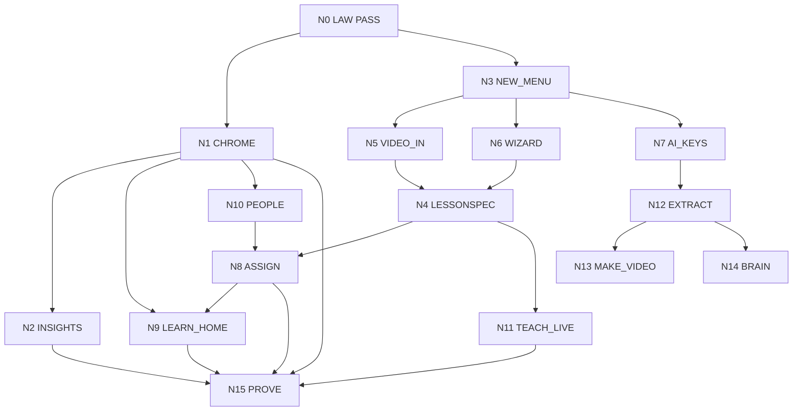

# Build graph
Dated 21 Sep 2026. Dev slice only. Field School PM (`bc-882e8bdf`) runs this **with** `COMPANY_GRAPH.md`.
Law: `docs/LAW.md`. Company functions: `COMPANY_GRAPH.md`. Chrome: `SHELLS.md`.
Launch stays **CLOSED**, **0/8**. This graph is not 8/8.

Every Dev node must name a company function (C1–C7), a room, and a hirer. If it cannot, it is a wave. Waves are over.

A node is work. An edge is a dependency. The loop is: load COMPANY_GRAPH + this file → ready nodes → spawn ≤2 → PASS or fail → write the row → load again. Do not wait for a new chat. Do not invent Wave 6.

Status: `PASS` | `READY` | `BLOCKED` | `IN_FLIGHT` | `HELD`.

## Current state (now)

| Area | Live fact | Why it is not desired |
| --- | --- | --- |
| Chrome | `site-header.tsx` lists Dashboard Lesson Tools Cart Children Progress Intent Path Portion Brain Admin | Ticket log. GTM fail. |
| Desk | `dashboard/page.tsx` fetches children if `orgs.includes("household")` | ICP fail. Child Test on Sales team. |
| Learn | Hire-path routes are the product | GTM fail. |
| Library | Wave 3 teach: text/upload/book/link. Units from supplied text. | Kitchen missing. |
| Composer | `0005` tables LIVE | No LessonSpec. |
| Factory | Remotion PASS in `plates/`. `render.lock` | Ops fail. No overlap. |
| Insights | `/admin` is a notice badge | Ops + finance fail. |
| AI | `0011` schema | Finance UI missing. |
| Brain | JSON dump | Not retrieval. |
| Identity | Three roles in schema | UI mixes them. ICP fail. |

Waves 1–3 and plates Wave 5 are **PASS**. Resume is forbidden.

## Desired state

A leader at https://portal.fieldschool.ai sees five words: Learn, People, Library, Insights, New.
Sales desk shows zero children. Household desk shows zero sales diagnostics.
New opens three doors: long-form video, wizard, connect AI (BYOK or credits).
Each door writes one LessonSpec. Leader can teach live, assign, or queue make-video.
A salesperson (login) and a tracked child (login none) each have a NextCard.
Insights charts are real aggregates. Finance burn is visible.
ICP files name both hirers. A human can hire the next hirer.
Launch stays CLOSED.

## Graph



## Nodes

| ID | Name | Serves | Status | Needs | Files | Done when |
| --- | --- | --- | --- | --- | --- | --- |
| N0 | Law | — | PASS | — | `docs/LAW.md` | Reading order exists. |
| N1 | Chrome | C5 GTM, C2 ICP | READY | N0 | `site-header.tsx`, dashboard | Leader bar: Learn People Library Insights New. Sales desk zero children. |
| N2 | Insights | C6 Ops, C1 Finance | BLOCKED | N1 | `app/src/app/insights/` | Six org-scoped charts. Click → person. Credit burn included. Honest empty. |
| N3 | New menu | C5 GTM | READY | N0 | `site-header.tsx` (not with N1) | Video / Wizard / Connect AI. |
| N4 | LessonSpec | C7 Dev | BLOCKED | N5 or N6 | composer tables | One JSON drives learn / teach / video. `source_unit_id`. |
| N5 | Video in | C7 | BLOCKED | N3 | teach + media | Cap or mp4 → draft units. |
| N6 | Wizard | C5 | BLOCKED | N3 | wizard route | What / who / teach-assign-video. |
| N7 | AI keys | C1 Finance | BLOCKED | N3 | settings + `0011` | BYOK wrap, last4 only. Or credits. |
| N8 | Assign | C5, C2 | BLOCKED | N4, N10 | assignments | One spec → salesperson and tracked child. |
| N9 | Learn home | C5 | BLOCKED | N1 | dashboard replacement | NextCard. Active org only. |
| N10 | People | C2 ICP | BLOCKED | N1 | people list | Sales = login learners. Household = children. Never both. |
| N11 | Teach live | C5 | BLOCKED | N4 | TeachDeck | Presenter view of the spec. |
| N12 | Extract | C7, C6 | BLOCKED | N7 | FastAPI + Celery | PDF or STT → units. Cycle 2. |
| N13 | Make video | C7 | BLOCKED | N12 | `plates/` | Queued master + cuts.json. |
| N14 | Brain | C7 | BLOCKED | N12 | pgvector | This org only. |
| N15 | Prove | all | BLOCKED | N1 N2 N8 N9 N11 | — | Both rooms. Hirer absent still moves. |

## File collision (hard)

`site-header.tsx` = N1 and N3. Never together.
`docs/icp-*.md` does not collide with `app/`. That is the Cycle 1 pair.

## Recommended Cycle 1

1. Stream A: **N1 Chrome** (`app/`)
2. Stream B: **C2 ICP** (`docs/icp-parent.md`, `docs/icp-leader.md`) per COMPANY_GRAPH

Then N2 Insights (new route) + C1 Finance store file.
Then N3 New menu + C5 GTM store file.

## Loop

1. Pull origin/main.
2. Read LAW + COMPANY_GRAPH + this file.
3. Restate the job and the desired product.
4. Print C1–C7 and N1–N15.
5. Spawn ≤2. Prefer docs/ + app/.
6. Finish. Flip rows. Loop in this chat.

Stop the project: N15 PASS **and** C2 + C1 + C5 artefacts exist. Chrome alone is not the company end.

## Held

Dest hash. AUTH_URL. Family LIVE. Just. Public flip. Launch 8/8. Child login. Django. Qdrant. New plate. Wave 2. Team price. Market count.

## Dean reply

```
Job (one sentence)
C#: PASS | IN_FLIGHT | READY | BLOCKED
N#: PASS | IN_FLIGHT | READY | BLOCKED
Spawned / PRs
Proof: five-item bar? sales desk zero children? ICP files name a hirer?
Next ready
Human: none | Cap take | upload | BYOK paste
```
