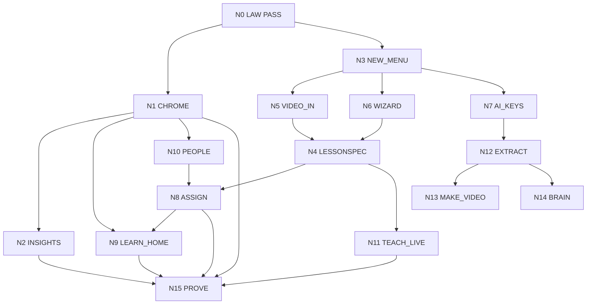

# Build graph
Dated 21 Sep 2026. Field School PM (`bc-882e8bdf`) runs this file in a loop.
Law: `docs/LAW.md`. Chrome: `SHELLS.md`. Product: `THREE_LOOPS.md`.
Launch stays **CLOSED**, **0/8**. This graph is not 8/8.

A node is work. An edge is a dependency. The loop is: load graph → ready nodes → spawn ≤2 → PASS or fail → write the row → load again. Do not wait for a new chat. Do not invent Wave 6.

Status: `PASS` | `READY` | `BLOCKED` | `IN_FLIGHT` | `HELD`.

## Current state (now)

| Area | Live fact | Why it is not desired |
| --- | --- | --- |
| Chrome | `site-header.tsx` lists Dashboard Lesson Tools Cart Children Progress Intent Path Portion Brain Admin | Ticket log. Nielsen fail. |
| Desk | `dashboard/page.tsx` fetches children if `orgs.includes("household")` | Child Test appears on Sales team. |
| Learn | Hire-path routes are the product | /intent /path /portion /brain is not a home. |
| Library | Wave 3 teach: text/upload/book/link. Units from supplied text. No extract. | Cap is a stove, not a kitchen. No wizard. No BYOK UI. |
| Composer | `0005` tables LIVE | No LessonSpec contract. |
| Factory | Remotion PASS in `plates/`. `render.lock` | Cannot overlap jobs. Make-video from spec missing. |
| Insights | `/admin` is a notice badge | No charts on `learning_events`. |
| AI | `0011` credits + wrapped keys | Metering is off the path. Key UI not in create. |
| Brain | JSON dump. FR-KB-1 held | Not org-scoped retrieval. |
| Identity | Three roles exist in schema | UI mixes them. |

Waves 1–3 and plates Wave 5 are **PASS**. Resume is forbidden.

## Desired state

A leader at https://portal.fieldschool.ai sees five words: Learn, People, Library, Insights, New.
Sales desk shows zero children. Household desk shows zero sales diagnostics.
New opens three doors: long-form video, wizard, connect AI (BYOK or credits).
Each door writes one LessonSpec. Leader can teach live, assign, or queue make-video.
A salesperson (login) and a tracked child (login none) each have a NextCard: this course, why, next.
Insights charts are real aggregates. Click a bar, open a person.
Launch stays CLOSED.

## Graph



## Nodes

| ID | Name | Status | Needs | Files (owners) | Done when |
| --- | --- | --- | --- | --- | --- |
| N0 | Law | PASS | — | `docs/LAW.md` | Reading order exists. |
| N1 | Chrome | READY | N0 | `app/src/components/site-header.tsx` | Leader bar: Learn People Library Insights New. Learner bar: Learn Me. No hire-path words. |
| N2 | Insights | BLOCKED | N1 | `app/src/app/insights/` (new) | Six org-scoped charts from real tables. Click → person. Honest empty. |
| N3 | New menu | READY | N0 | `site-header.tsx` (shared with N1 — **do not run N1+N3 together**) | New opens Video / Wizard / Connect AI. |
| N4 | LessonSpec | BLOCKED | N5 or N6 | composer tables + a `lesson_spec` JSON column or view on `lessons` | One JSON drives learn / teach / video. Checks have `source_unit_id`. |
| N5 | Video in | BLOCKED | N3 | Wave 3 teach + media upload | Cap or mp4 becomes draft units. |
| N6 | Wizard | BLOCKED | N3 | Library wizard route | What / who / teach-assign-video fills a spec. Leader approves. |
| N7 | AI keys | BLOCKED | N3 | settings + `0011` tables | BYOK wrap AES-GCM, last4 only, never in GET. Or platform credits. Org default. |
| N8 | Assign | BLOCKED | N4, N10 | assignments API + UI | Same spec assigned to one login salesperson and one tracked child. |
| N9 | Learn home | BLOCKED | N1 | replace dashboard dump | NextCard: course, why, next. Active org only. |
| N10 | People | BLOCKED | N1 | people list | Sales = login learners. Household = tracked children. Never both. |
| N11 | Teach live | BLOCKED | N4 | TeachDeck on `/o/:slug/teach/:id` | Presenter view of the spec. |
| N12 | Extract | BLOCKED | N7 | FastAPI worker + Redis + Celery | PDF or STT → units. JobChip. Next does not block on encode. |
| N13 | Make video | BLOCKED | N12 | `plates/` job from spec | 16:9 master + cuts.json queued. Existing plates only. |
| N14 | Brain | BLOCKED | N12 | pgvector on units + notes | Retrieve this org only. Not a JSON dump. |
| N15 | Prove | BLOCKED | N1 N2 N8 N9 N11 | — | Week done-when true on sales AND household. |

N13 and N14 are **not** required to start N15 if N12 is still BLOCKED, but N15 cannot PASS until N8 and N9 PASS.
N12 is Cycle 2. Do not stand it up in Cycle 1.

## File collision (hard)

| File | Nodes |
| --- | --- |
| `app/src/components/site-header.tsx` | N1, N3 |
| `app/src/app/dashboard/page.tsx` | N1, N9 |
| `app/src/app/api/composer/**` | N4, N5, N6 |
| `app/src/app/o/**/teach/**` | N5, N6, N11 |

If two ready nodes share a file, run **one**. The other waits.
Therefore Cycle 1 is **N1 then N3**, not N1 parallel N3.
Allowed parallel with N1: none on header. After N1 PASS, N2 (insights, new files) can run with N3 (header New menu) **if** N3 is a small additive PR on the already-collapsed header.
Safer Cycle 1: **N1 only**, then **N3 + N2** (N2 is new route, N3 is header add).

Recommended Cycle 1 (this paste):
1. Stream A: **N1 Chrome** (header + kill household fetch on sales desk). Include People filter N10 if files stay in dashboard/people and not header.
2. Stream B: **N2 Insights** new route `app/src/app/insights/` — does not touch header. Honest empty six views.
After both PASS: N3 New menu on the collapsed header, then N5/N6.

## Loop (PM, every cycle)

1. Pull `origin/main`.
2. Read `docs/LAW.md` then this file.
3. Restate desired state in four lines.
4. List nodes: PASS / READY / BLOCKED / IN_FLIGHT.
5. Ready = all `Needs` are PASS, not HELD, files free.
6. Spawn at most two streams. Builder + checker + evaluator each.
7. Finish. Proof table. Dean reply.
8. Open a docs PR or commit that flips the node row to PASS (or leave READY with the blocker named).
9. Immediately spawn the next ready set. Do not stop because the chat feels done.

Stop a stream: lock would move, budget, two identical verify fails, `NEEDS YOU`.
Stop the project: N15 PASS, or CDM hold.

## Held forever this week

Dest hash. AUTH_URL flip. Family LIVE `bc-4765f2f0`. Just. Public site distribute. Launch 8/8. Child login. Django. Qdrant. New Remotion plate. Wave 2 resume. Steal family agent.

## Dean reply shape

```
Desired (4 lines)
Graph: N# PASS | N# IN_FLIGHT | N# READY | N# BLOCKED
Spawned: ...
PRs: ...
Proof: sales desk has zero children? five-item bar? yes/no
Next ready: ...
Human: none | Cap take | upload | BYOK paste
```
