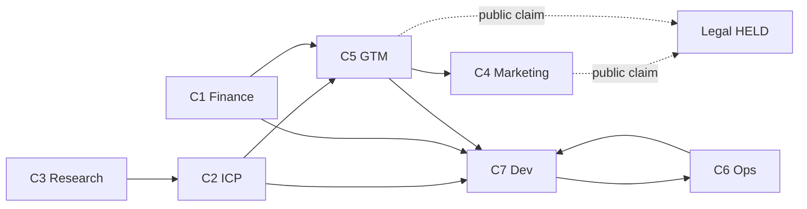

# Company graph
Dated 21 Sep 2026. Why the ethos exists. How the company functions run with Dev.
Read `FIELD-SCHOOL-ETHOS-MEMO.md` §1 first. Launch stays CLOSED 0/8. This file is not 8/8.

Dev graph: `BUILD_GRAPH.md` (N1–N15). This file is the company graph (C1–C7). They run together. Dev is not allowed to wait until N15 before ICP, finance, or GTM speak. Store files are not allowed to wait until chrome is pretty. Files must not collide: `docs/icp-*.md` vs `app/`.

## Why the ethos exists

Without it, each function invents a different company.

| Function left alone | It will build |
| --- | --- |
| Dev | Waves, dest SHAs, 12-item headers, Children on the sales desk |
| ICP | A smaller customer that is easier to describe (homeschool only, or LMS buyers) |
| Finance | A fourth SKU, child seats, live cards, credits-as-product |
| Marketing | A public flip and gym copy so someone can "find us" |
| GTM | A course catalog and a cart |
| Research | Market counts and blog ICPs |
| Ops | More agents, more clocks, no outcome |

The ethos freezes one job so those functions stay one company:

**When I am accountable for people's development and for the organization's success, and I cannot sit with them every hour, I invest in Field School so each person keeps moving on a path fit to who they are now, they get better, the organization gets better, and the learning actually takes.**

JTBD is the language connector. Hirer is the User. Person in development is not the buyer. Two rooms (household, team). Three household prices. Holds keep the public claim closed. Holds do not stop the week's work.

ICP may sharpen the job. Builder may not. Finance may not. Marketing may not.

## Seven functions (this is the company)

Launch gate still has eight nodes (Product, ICP, Brand, Offer, Marketing, Sales, Legal, Plan). Those are launch scores. These seven are how the company works every week. Legal stays a lock on GTM and Marketing, not a campaign.

| ID | Function | Ethos seat | Artefact this week | Constrains Dev |
| --- | --- | --- | --- | --- |
| C1 | Finance | Offer + math | `docs/finance-units.md` | Prices $100/$200/$1,000. Credits or BYOK. $0 added. No live charge. Insights credit burn (N2, N7). No fourth SKU. No child seat. |
| C2 | ICP | ICP | `docs/icp-parent.md` and `docs/icp-leader.md` | Who is on People (N10). Who Learn home is for (N9). Sales desk never shows a child. |
| C3 | Market research | Who we get after | `docs/research-forces.md` | Four forces, not a TAM. Feeds C2. Does not invent a third room. |
| C4 | Marketing | Marketing | `docs/marketing-parent-hire.md` | Copy on New menu and NextCard. Foundry tokens. Public site unflipped. |
| C5 | GTM | Sales + Offer | `docs/gtm-hire.md` | A human can hire the next hirer at the portal. Assign (N8) must be that motion. No ads. |
| C6 | Operations | Plan + intelligent ops | clocks + Insights | Company version of "moves when I am not in the room." N2 is the operator desk. Notion stays the map. |
| C7 | Dev | Product | `BUILD_GRAPH.md` N1–N15 | Implements the loop in `app/`. Does not author the job. |

Brand is not a eighth campaign. Brand is the distinctive assets already locked (charcoal, cream, olive, Fraunces, foundry words). Marketing and chrome use them. Do not write a new metaphor.

Legal is not a campaign. COPPA spine. Counsel signs before any public claim. GTM and Marketing stop at that wall.

## Building the right thing from the get-go

A Dev node is illegal if it cannot name:

1. Which function it serves (C1–C7)
2. Which room (household or team)
3. Which hirer (parent or leader)
4. How the person in development stays not-the-buyer
5. What still works when the hirer leaves the room

Examples:

- N1 Chrome serves C5 + C2. If Sales team still shows a child, ICP failed inside Dev.
- N2 Insights serves C6 + C1. Charts of movement and credit burn, not a notice badge.
- N3 New menu serves C5. Three doors a hirer understands: video, wizard, their AI or ours.
- N7 AI keys serves C1. BYOK wrap vs platform credits. Not a new price.
- N8 Assign serves C5 + C2. Same spec to a login salesperson and a tracked child, never mixed on one desk.
- N9 Learn home serves C5. Course / why / next. Not /intent /path /portion.

If Dev cannot point at a function, it is a wave. Waves are over.

## Company graph

Research feeds ICP. ICP and Finance feed GTM and Dev. GTM feeds Marketing copy. Ops and Dev feed each other (Insights). Marketing and GTM do not cross Legal.

## Company nodes (status)

| ID | Status | Needs | Files | Done when |
| --- | --- | --- | --- | --- |
| C1 Finance | READY | — | `docs/finance-units.md` | Three prices named as hours. Credits vs BYOK. What N2 must chart. No live charge. No team price. |
| C2 ICP | PASS | — | `docs/icp-parent.md`, `docs/icp-leader.md` | Both files. Headings from ethos §4. Anti-job present. Who we get after. |
| C3 Research | READY | C2 started | `docs/research-forces.md` | Four forces per room. No market count. |
| C4 Marketing | BLOCKED | C2, C5 | `docs/marketing-parent-hire.md` | Five blocks. Public site unflipped. |
| C5 GTM | READY | C2 in flight ok | `docs/gtm-hire.md` | Human hire motion for parent and for leader. Portal URL. No ads. |
| C6 Ops | READY | — | Insights = N2. Clocks already in ROUTINES.md | N2 honest empty or live. Sunday scores both rooms. |
| C7 Dev | IN_FLIGHT | C2, C1 should be in flight | `BUILD_GRAPH.md` | N1 chrome PASS on `cursor/n1-chrome`. N2 is next. |

C2 and C1 are High autonomy store files. They do not wait on N1. They should land the same week as N1 so chrome is scored against a named hirer.

## Cycle 1 (company + dev, files do not collide)

| Stream | Node | Files |
| --- | --- | --- |
| A | N1 Chrome | `app/src/components/site-header.tsx`, `app/src/app/dashboard/page.tsx` |
| B | C2 ICP | `docs/icp-parent.md`, `docs/icp-leader.md` |

N2 Insights waits until N1 PASS (or uses a new route with no header touch, still allowed per BUILD_GRAPH if header is free). Prefer N1 + C2 this cycle so People/Learn are not guessed.

Next cycle: N2 Insights (C6/C1) + C1 Finance store file, or N3 New menu + C5 GTM, depending on file locks.

## Loop

Same as BUILD_GRAPH. PM prints C1–C7 and N1–N15 every cycle. Spawn ≤2. One company stream + one dev stream is the default when `docs/` and `app/` do not collide.

Evaluator on a company artefact uses ethos §7. Evaluator on a Dev artefact also checks the five "right thing" questions above.

## Held

Launch 8/8. Public flip. Live card. Team price. Child login. Market count. Brand metaphor rewrite. Legal rewrite to "cover both rooms" in one pass.
