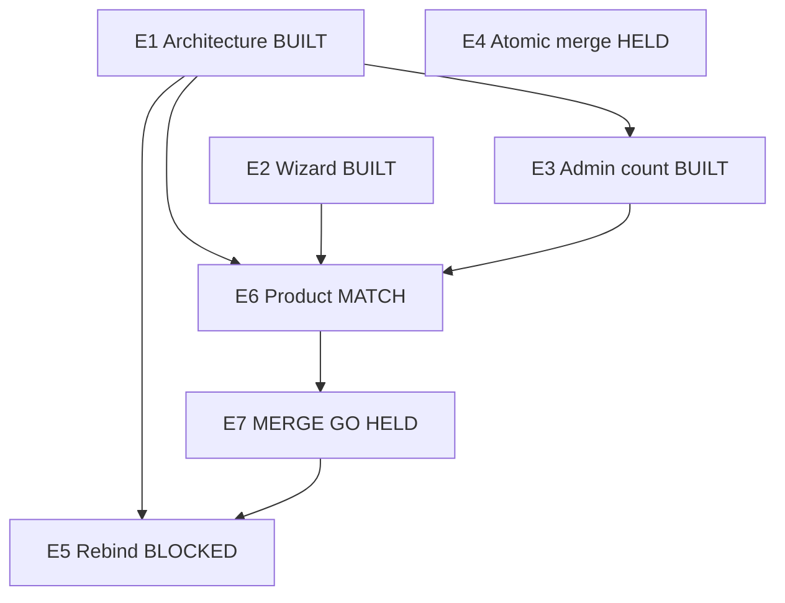

# Engineering graph

Dated 7 Oct 2026. Current program only. N1–N15 stay in [BUILD_GRAPH.md](./BUILD_GRAPH.md) and `state.json`. Pick them with `pick-next.mjs`. Pick this program with:

```
node docs/staff/pick-engineering.mjs
```

Machine file: [engineering-graph.json](./engineering-graph.json). Launch stays **CLOSED**, **0/8**. This graph is not 8/8.

Status: `READY` | `BUILT` | `BLOCKED` | `HUMAN` | `HELD` | `PASS`.

`BUILT` means the draft has the code and the proofs. `PASS` means the node is on main. None of these nodes are `PASS`.

## Outcome

An adult hirer finishes an assessment, sees the placement on their profile, and skill and intelligence results stay on the account. Staff can see how many of those tools are saved. A child profile stays private and has no photo. Launch stays CLOSED 0/8.

The outcome stays open until E1, E2, E3, and E5 are `PASS` on main. E4 is outside that list. The Profile M1 owner holds the atomic gate write.

## Goals

| ID | Goal | Serves | Met when |
| --- | --- | --- | --- |
| G1 | Durable tools | C7 | Skill and Intelligence are server-scored rows on the member, one row per attempt. |
| G2 | One chrome | C5 | One AppShell host. The navy coaching shell is retired. |
| G3 | Adult placement | C2 | Enneagram, DISC, and Myers-Briggs lock at 75 percent, or the run ends with an honest best read. The copy stays a Field School estimate. |
| G4 | Profile shows the placement | C2 | The adult profile lists a locked category at 75 percent or higher and labels a weaker read as a best read. |
| G5 | Staff count | C6 | The admin user snapshot counts saved tools for that email and returns the number alone. |
| G6 | Fresh gates | C7 | A retake moves lastAt. The atomic JSONB merge stays with the Profile M1 owner. |
| G7 | One gate write | C7 | After PR 343 is on main, a finished wizard track writes tool_results through the same gate path. |

## Graph



## Nodes

| ID | Name | Goals | Status | Needs | PR | SHA | Done when |
| --- | --- | --- | --- | --- | --- | --- | --- |
| E1 | Architecture and chrome | G1 G2 G6 | BUILT | — | 343 | `c929da985bc33279b38bd588263b22a3b9bd5f2d` | Tool results, records, knowledge edges, and one AppShell are on the draft. Item 9 refreshes lastAt on a retake. Visual seal stays with Designer. |
| E2 | Assessment wizard | G3 G4 | BUILT | — | 344 | `86e022576fa132f6aa7dab25f6ddda96ffce10a8` | Personality placement, start answer resume result, wizard meter, neural-web finish, and adult profile results are on the draft. Kid page stays free of that UI. |
| E3 | Admin assessment count | G5 | BUILT | E1 | 345 | `ad8bb66e547081af0f19435651a183c47bab376d` | The user snapshot joins tool_results by email, counts one saved tool per adult, and skips a child member. |
| E4 | Atomic gate merge | G6 | HELD | — | — | — | `recordAdultGate` writes the gates JSON in one atomic update. The M1 owner opens that seal. |
| E5 | Rebind wizard gates | G7 | BLOCKED | E1 on main | 344 | — | After E1 is PASS on main, rebase the wizard, renumber 0019 and 0020 only if 0018 collides, and point `recordTrackGate` at tool_results. |
| E6 | Product MATCH | — | HUMAN | E1 E2 E3 | — | — | Product re-MATCHes PR 343 item 9 and the PR 344 proofs on the SHAs above. |
| E7 | MERGE GO | — | HELD | E6 | — | — | Ben gives MERGE GO. Until then the drafts stay drafts. |

## Now

CODE none. HUMAN E6 Product MATCH. BLOCKED E5. HELD E4 and E7.

G1 through G5 are built on the drafts and the merge is held. G6 is open because the atomic write is held. G7 is open until E1 is on main.

## Locks

Drafts stay drafts until Ben gives MERGE GO. Sealed Profile M1 files stay sealed. AUTH_URL, Stripe live, Caddy, and the public site stay as they are. Kid profiles stay private, without photos, intake-gated, and parent-edited. Launch stays CLOSED 0/8.
