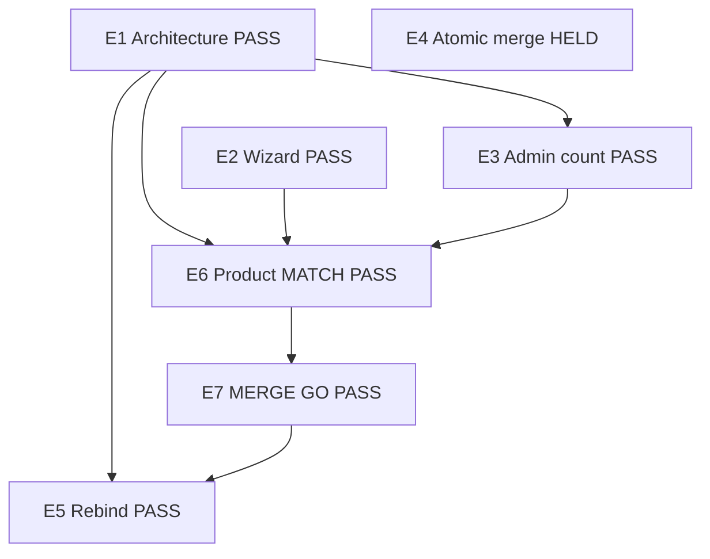

# Engineering graph

Dated 7 Oct 2026. Current program only. N1–N15 stay in [BUILD_GRAPH.md](./BUILD_GRAPH.md) and `state.json`. Pick them with `pick-next.mjs`. Pick this program with:

```
node docs/staff/pick-engineering.mjs
```

Machine file: [engineering-graph.json](./engineering-graph.json). Launch stays **CLOSED**, **0/8**. This graph is not 8/8.

Status: `READY` | `BUILT` | `BLOCKED` | `HUMAN` | `HELD` | `PASS`.

`BUILT` means the draft has the code and the proofs. `PASS` means the node is on main.

## Outcome

An adult hirer finishes an assessment, sees the placement on their profile, and skill and intelligence results stay on the account. Staff can see how many of those tools are saved. A child profile stays private and has no photo. Launch stays CLOSED 0/8.

The outcome is done. E1, E2, E3, and E5 are `PASS` on main. E4 is outside that list. The Profile M1 owner holds the atomic gate write.

## Goals

| ID | Goal | Serves | Met when |
| --- | --- | --- | --- |
| G1 | Durable tools | C7 | Skill and Intelligence are server-scored rows on the member, one row per attempt. |
| G2 | One chrome | C5 | One AppShell host. The navy coaching shell is retired. |
| G3 | Adult placement | C2 | Enneagram, DISC, and Myers-Briggs lock at 75 percent, or the run ends with an honest best read. The copy stays a Field School estimate. |
| G4 | Profile shows the placement | C2 | The adult profile lists a locked category at 75 percent or higher and labels a weaker read as a best read. |
| G5 | Staff count | C6 | The admin user snapshot counts saved tools for that email and returns the number alone. |
| G6 | Fresh gates | C7 | A retake moves lastAt. The atomic JSONB merge stays with the Profile M1 owner. |
| G7 | One gate write | C7 | After PR 343 is on main, a finished wizard track writes tool_results through the same gate path. |

## Graph



## Nodes

| ID | Name | Goals | Status | Needs | PR | SHA | Done when |
| --- | --- | --- | --- | --- | --- | --- | --- |
| E1 | Architecture and chrome | G1 G2 G6 | PASS | — | 343 | `11c0b3d81346185edc333665c3eda0964d413214` | On main in merge 11c0b3d. Tool results, records, knowledge edges, and one AppShell. Item 9 refreshes lastAt on a retake. Visual seal stays with Designer. |
| E2 | Assessment wizard | G3 G4 | PASS | — | 344 | `b2754ba81a9fae85f4d9efb81b534872e387693a` | Personality placement, start answer resume result, wizard meter, neural-web finish, and adult profile results ship with the rebind. Kid page stays free of that UI. |
| E3 | Admin assessment count | G5 | PASS | E1 | 345 | `48568ce5d3faf24c39e435a0ffc09026f9838209` | On main in merge 48568ce. The user snapshot joins tool_results by email, counts one saved tool per adult, and skips a child member. |
| E4 | Atomic gate merge | G6 | HELD | — | — | — | `recordAdultGate` writes the gates JSON in one atomic update. The M1 owner opens that seal. |
| E5 | Rebind wizard gates | G7 | PASS | E1 | 344 | `b2754ba81a9fae85f4d9efb81b534872e387693a` | A finished Skills or Profile run writes tool_results when every official Tools item was answered, then `recordAdultGate`. A short run moves the gate mark and does not invent answers. Personality is not written. 0018, 0019, and 0020 stay distinct. |
| E6 | Product MATCH | — | PASS | E1 E2 E3 | — | — | Ben said merge go on 7 Oct 2026. That stands in for the Product MATCH step on this program. |
| E7 | MERGE GO | — | PASS | E6 | — | — | Ben said merge go. PRs 343, 345, and 346 are on main. PR 344 merges with the rebind. |

## Now

CODE none. HUMAN none. BLOCKED none. HELD E4.

G1 through G5 and G7 are on main. G6 stays open because the atomic write is held.

## Locks

E4 stays with the Profile M1 owner. Sealed Profile M1 files stay sealed. AUTH_URL, Stripe live, Caddy, and the public site stay as they are. Kid profiles stay private, without photos, intake-gated, and parent-edited. Launch stays CLOSED 0/8.
