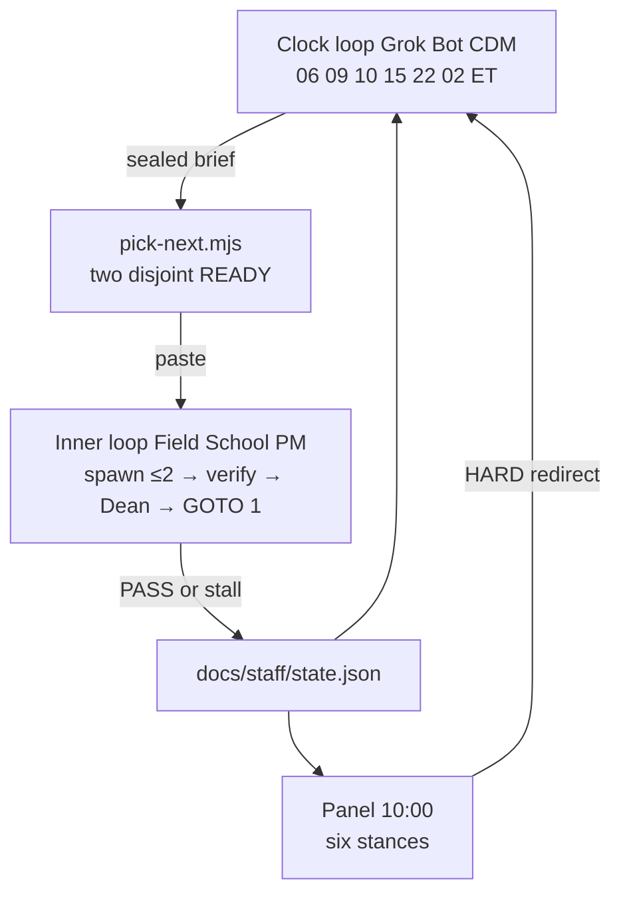

# Loop

Dated 21 Sep 2026. This is how Field School moves from current state to the outcome.
Grok Bot (CDM) runs the clock loop. Field School PM runs the inner loop. Panel scores the live portal. Neither is a daemon. The clocks restart the inner loop.
Launch stays CLOSED 0/8. This file is not 8/8.

Read after ethos. Before COMPANY_GRAPH and BUILD_GRAPH.

## Outcome (stop the company when this is true, not before)

A hirer (parent or leader) signs in at https://portal.fieldschool.ai, selects a person in development who is not the buyer, and that person keeps moving on a path when the hirer leaves the room.

Both rooms exist. Household child stays `kind:child`, `login:none`. Team teammate may log in and does not own the path.
Chrome is five words. Sales desk shows zero children. New has three doors. One LessonSpec. Insights are real charts. Factory: one Cap take → WhisperX words → four plates → master.mp4.
ICP, finance units, and GTM hire files exist. A human can hire the next hirer at the three prices. Public site unflipped. Counsel unsigned. Launch CLOSED.

Chrome PASS alone is not the outcome. Dest SHA is not the outcome. Wave proofs are not the outcome. Six panel PASS on chrome still is not Launch 8/8.

## Four loops



| Loop | Who | When | Does |
| --- | --- | --- | --- |
| Clock | Grok Bot = CDM | 06 / 09 / 15 / 22 / 02 ET | Inspect GitHub + state.json. Run pick. Emit sealed brief. @CTO. Stop. |
| Panel | New Bot = Panel Runner | 10:00 ET weekday | Six personas walk the portal. File PANEL blocks. Do not write app/. |
| Company | Writer / Gate on `docs/` | When pick names C# | ICP, finance, GTM, research, marketing. |
| Build | Field School PM on `app/` `plates/` | When pick names N# or Factory-slim | Implement. Checker. Evaluator. PR. Flip state.json. |

Wire never changes: **CDM → CTO → Cursor Gate → Field School PM**. Panel never messages Field School PM. CDM never messages Field School PM. No peer C-suite. Max two Cursor streams. Files cannot collide. Do not invent seats.

## Automatic pick (do not invent a third)

Source: `docs/staff/state.json`. Machine: `node docs/staff/pick-next.mjs`. Panel HARD_FAIL can override the pick (see PANEL.md).

Score order:

1. N1 Chrome
2. C2 ICP
3. Factory-slim (`plates/` WhisperX → captions, four plates)
4. C1 Finance
5. N2 Insights
6. C5 GTM
7. N3 New menu (not with N1; same `site-header.tsx`)
8. N10 People (after N1)
9. N9 Learn home (after N1; collides dashboard with N1)
10. N6 Wizard / N5 Video in / N7 AI keys (after N3)
11. N4 LessonSpec (after N5 or N6)
12. N8 Assign (after N4 and N10)
13. N11 Teach live
14. N12 Extract (Cycle 2)
15. N13 Make video / N14 Brain
16. N15 Prove (after N1 N2 N8 N9 N11)
17. C3 Research (after C2 started)
18. C4 Marketing (after C2 and C5)
19. C6 Ops (Insights = N2)

Take the first two READY whose file sets do not intersect. Skip HELD and BLOCKED. If N1 is IN_FLIGHT, do not pick N3 or N9.
If any panel HARD_FAIL names N1, pick N1 even if a later node looks fun.

Default if state is untouched: **N1 + C2**.

## Inner loop (Field School PM, one chat)

1. Pull origin/main.
2. Read LAW, this file, COMPANY_GRAPH, BUILD_GRAPH, SHELLS, FACTORY_VIDEO, PANEL.md, state.json.
3. Print C# and N# from state.json, then confirm against the repo.
4. If the sealed brief names streams, do those. Else run pick-next.
5. Spawn ≤2. Tonight exception: PM may be builder on one stream.
6. Verify. EVALUATOR block. PR on `cursor/<id>-<slug>`.
7. Patch `docs/staff/state.json` on that branch.
8. Dean reply. If the clock seal is not met and budget remains, GOTO 1 in this chat.
9. Stop when pick-next prints `IDLE`, a lock would move, `NEEDS YOU`, two identical verify fails, or N15 plus C2 C1 C5 exist.

## Clock loop (Grok Bot, each fire)

Prompt: `docs/staff/GROK_BOT.md`. Panel: `docs/staff/GROK_BOT_PANEL.md`. Each clock is a **handoff**.

| Clock | Extra |
| --- | --- |
| 06 harvest | What shipped overnight. Health. Pick. Sealed brief. Quiet to Ben. |
| 09 weekday | Score table. Confirm or replace the 06 pick. |
| 10 panel | Six stances. Redirect summary only. |
| 15 mid-course | Read panel HARD. Keep, redirect, or stop IN_FLIGHT. |
| 22 night | Day score. Overnight brief safe with Ben asleep. |
| 02 verify | Health. Family LIVE and Just still locked. First line for 06. |

Sunday 09 also scores Launch 0/8. Do not invent 8/8.

## Health every clock

- Guest `https://portal.fieldschool.ai/api/me` is `{guest:true}`
- `https://edit.fieldschool.ai/health` is 200
- Family LIVE `bc-4765f2f0` not stolen
- Just `27pn9xs0zk8a73g` locked
- Dest hash untouched

Fail health → sealed brief is stop-the-stream, not a new node.

## Sealed brief (CDM writes, Gate pastes into Field School PM)

```
Clock: 06|09|10|15|22|02
Pick: <id> + <id or none>
Project: Field School PM (bc-882e8bdf)
Branch: cursor/<id>-<slug>
Room: household|team|company-prose
Files:
Done when:
Do not: Wave 2, child login, Remotion-in-Next, Django, Launch 8/8, steal family LIVE, Just, dest, AUTH_URL, public flip, fourth SKU
Human needed: none | Cap take | upload | BYOK paste | legal sign | test seat
Paste: Read docs/staff/LOOP.md. Run node docs/staff/pick-next.mjs. Do the pick above. Loop until this clock's streams PASS or STOP.
```

## Held forever this week

Launch 8/8. Public flip. Live card. Child login. Team price. Market count. Django. Remotion MCP. Remotion-in-Next. New antagonist plate. Wave 2 resume. Coach unhold. Steal `bc-4765f2f0`. Official psychometric item banks. New C-suite seats.
