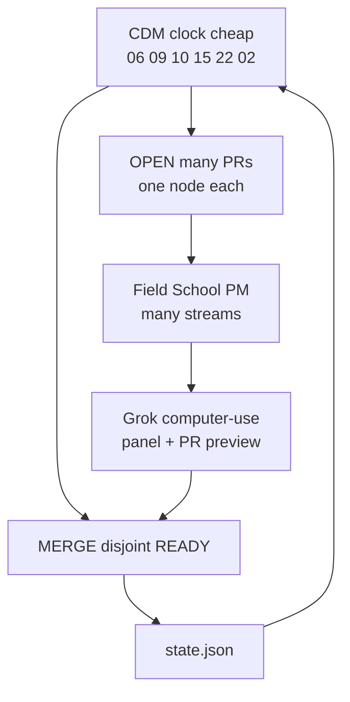

# Loop

Dated 22 Sep 2026. Graph-engineered parallel. Grok Bots decide and test. Cursor builds.
Launch stays CLOSED 0/8. This file is not 8/8.

Read after ethos. Before COMPANY_GRAPH and BUILD_GRAPH.

## Outcome (stop the company when this is true, not before)

A hirer (parent or leader) signs in at https://portal.fieldschool.ai, selects a person in development who is not the buyer, and that person keeps moving on a path when the hirer leaves the room.

Both rooms exist. Household child stays `kind:child`, `login:none`. Team teammate may log in and does not own the path.
Chrome is five words. Sales desk shows zero children. New has three doors. One LessonSpec. Insights are real charts. Factory: one Cap take → WhisperX words → four plates → master.mp4.
ICP, finance units, and GTM hire files exist. A human can hire the next hirer at the three prices. Public site unflipped. Counsel unsigned. Launch CLOSED.

## Graph law (this is how 20 PRs stay aligned)

The graph is not a queue of two. It is a DAG.

| Verb | Meaning |
| --- | --- |
| OPEN | A PR may exist for every node that is not PASS and not HELD. 10, 20, 30 PRs is success if each PR is one node, one room, named files. |
| MERGE | Only READY nodes whose file sets do not collide. N3 never merges before N1 is PASS on main. N12 stays HELD. N15 never merges before N1 N2 N8 N9 N11. |
| TEST | Grok computer-use walks the live portal (or a preview). Scores. CDM decides merge / hold / rebase. |

Blocked drafts are legal. They wait. They do not merge. That is how we go fast without lying about deps.

One room per PR. One node per PR. Rebase a blocked PR onto main after its needs PASS. Do not rewrite it as a different node.

## Four loops



| Loop | Who | Tokens | Does |
| --- | --- | --- | --- |
| Clock | CDM | Cheap. 15 lines. No novel. | Health. `gh pr list`. pick-next MERGE/OPEN. @CTO. Stop. |
| Open/build | Field School PM | Cursor, not Grok | One PR per node. Many at once. |
| Test | One panel runner | Computer-use. One bot. | Walk live + MERGE previews. PANEL blocks. |
| Decide | CDM | Cheap | Merge READY green. Hold blocked. Close only HELD or lock-breakers. |

Wire: **Ben → CDM → (task bots) and CDM → CTO → Cursor Gate → Field School PM**.
CDM never messages Field School PM. Do not invent C-suite. Panel is task bots CDM creates.

## Token budget (Grok)

Spend Grok on **eyes and decisions**. Do not spend Grok rewriting LOOP.md, summarizing GitHub in prose, or six bots each reading five markdown files.

| Spend | Skip |
| --- | --- |
| Computer-use: open portal, count header words, switch Org, screenshot | Harvest essays |
| One FS Panel Runner PERSONA_ID=ALL | Six full-context panel bots unless a HARD needs a second pair of eyes |
| CDM: MERGE list + 3 HARD ids + Human needed | Reciting ethos |
| Cursor writes code | Grok writing app/ |

Clocks stay handoffs. If the last clock's MERGE list is unchanged and health is green, CDM posts `NO CHANGE` and stops.

## Automatic pick

`node docs/staff/pick-next.mjs` prints MERGE and OPEN.

- MERGE = all disjoint READY. Not a cap of two.
- OPEN = every node that is not PASS and not HELD. Drafts allowed.
- N3 / N9 wait for N1 PASS on main before MERGE. They may stay OPEN as drafts.
- N12 HELD. Close or leave draft. Never merge this week.
- Panel HARD on chrome does not close other PRs. It blocks MERGE of anything that collides with N1 until N1 is on main.

This morning (22 Sep) if state is untouched: MERGE **N1 C2 FACTORY C1 C5 C6**. OPEN the rest except N12. Live PRs already exist 206–226. Keep them. Merge 206 first among colliding header PRs.

## Inner loop (Field School PM)

1. Pull origin/main.
2. Read LAW, this file, state.json, SHELLS.
3. OPEN missing node PRs. One node, one branch, one room.
4. MERGE only what pick-next says MERGE and CI is green.
5. Rebase drafts onto main after their needs PASS.
6. Patch state.json on the merged branch: that id PASS.
7. Do not merge HELD. Do not merge N3 onto N1. Do not merge N15 early.
8. Stop a stream that would move a lock.

## Clock extras (still cheap)

| Clock | Extra |
| --- | --- |
| 06 | Health. What merged. MERGE list. |
| 09 | Same. Assign Gate the MERGE set. |
| 10 | One panel runner, computer-use, live portal. |
| 15 | Keep / merge / rebase. Not a new novel. |
| 22 | MERGE left for overnight. Safe with Ben asleep. |
| 02 | Health. Locks. |

## Health every clock

- Guest `https://portal.fieldschool.ai/api/me` is `{guest:true}`
- `https://edit.fieldschool.ai/health` is 200
- Family LIVE `bc-4765f2f0` not stolen
- Just `27pn9xs0zk8a73g` locked
- Dest hash untouched

Fail health → stop MERGE. Do not open more.

## Sealed brief

```
Clock:
MERGE: <ids>
OPEN: keep drafts <ids>
CLOSE: only HELD or lock-breakers
Project: Field School PM (bc-882e8bdf)
Do not: merge N3 before N1 on main, merge N12, merge N15 early, Wave 2, child login, Remotion-in-Next, Launch 8/8, dest, AUTH_URL, family LIVE, Just
Human needed: merge buttons | none | test seat
```

## Held forever this week

Launch 8/8. Public flip. Live card. Child login. Team price. Market count. Django. Remotion MCP. Remotion-in-Next. New antagonist plate. Wave 2 resume. Coach unhold. Steal `bc-4765f2f0`. Official psychometric item banks. New C-suite seats. Merging N12.
